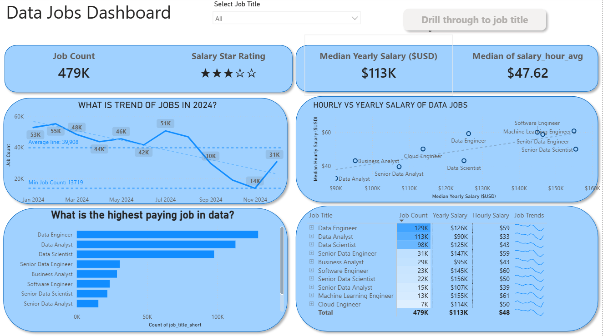
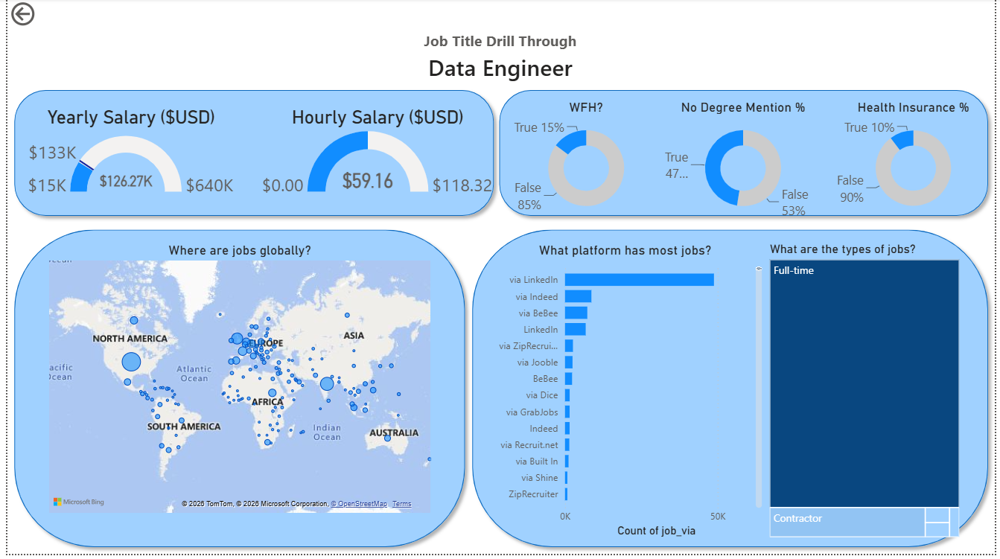

# 📊 Data Jobs Dashboard using Power BI

## 📌 Overview

The **Data Jobs Dashboard** is an interactive Power BI project built to analyze the **2024 data job market**. It helps users explore salary trends, job demand, hiring platforms, work-from-home opportunities, and job distribution across the world.

The dashboard is designed for aspiring data professionals, job seekers, and career changers who want to understand the current data job market and make informed career decisions.

> **Note:** This project was built by following and extending the excellent Power BI guided tutorial by **Luke Barousse**. The dashboard was recreated independently as part of my Power BI learning journey.

---

## Business Problem

Job market information for data professionals is often scattered across multiple platforms, making it difficult to compare salaries, hiring trends, and job opportunities.

This dashboard consolidates the data into a single interactive report, enabling users to explore the data job market, compare salaries across roles, analyze hiring trends, and make informed career decisions.

## 📂 Dataset

The dashboard uses a real-world dataset containing **2024 data job postings**, including:

- Job Titles
- Yearly Salary
- Hourly Salary
- Company Information
- Job Locations
- Hiring Platforms
- Work From Home Availability
- Health Insurance
- Degree Requirement
- Employment Type

---

## 🛠️ Skills & Technologies Used

### Power BI
- Interactive Dashboard Design
- Drill Through Navigation
- Slicers
- KPI Cards
- Gauge Charts
- Map Visualizations
- Scatter Charts
- Line Charts
- Bar Charts
- Tables
- Custom Dashboard Design

### Data Modeling
- Relationships
- Measures
- Aggregations
- Median Calculations

### DAX

Created DAX measures for:

- Median Yearly Salary
- Median Hourly Salary
- Job Count
- Salary Star Rating
- Average Salary Calculations

---

# 📈 Dashboard Features

## 🏠 Main Dashboard

The main dashboard provides a high-level overview of the 2024 data job market.

### 📌 KPIs

- Total Job Count
- Median Yearly Salary
- Median Hourly Salary
- Salary Star Rating

### 📊 Visualizations

- 📈 Monthly Job Trend
- 📊 Highest Paying Data Jobs
- 📉 Hourly vs. Yearly Salary Scatter Plot
- 📋 Job Summary Table
- 🎛️ Job Title Slicer
- 🔍 Drill Through Navigation

---

## 🔍 Job Drill Through Page

Selecting any **Job Title** opens a detailed analysis page containing:

- 💰 Yearly Salary Gauge
- ⏱️ Hourly Salary Gauge
- 🌍 Global Job Location Map
- 🏠 Work From Home Percentage
- 🎓 Degree Requirement Percentage
- 🏥 Health Insurance Availability
- 🌐 Top Hiring Platforms
- 📦 Employment Type Distribution

---

## 📊 Key Insights

Using this dashboard, users can discover:

- Median salaries across different data roles
- Highest paying data careers
- Monthly hiring trends during 2024
- Relationship between hourly and yearly salaries
- Global distribution of data jobs
- Most popular hiring platforms
- Work-from-home availability by job role
- Degree requirement trends
- Health insurance availability
- Employment type distribution

---

## Interactive Features

The dashboard includes several interactive features such as:

- Job Title Slicer
- Cross Filtering
- Drill Through Navigation
- Hover Tooltips
- Interactive Tables
- Dynamic KPI Cards

---

## Dashboard Preview

### 🏠 Main Dashboard



### 🔍 Job Drill Through Dashboard



---

## 📁 Project Structure

```text
Data-Jobs-Dashboard/
│
├── Data Jobs Dashboard.pbix
├── README.md
├── DashboardPage1.png
├── DashboardPage2.png
└── dataset/
```

---

## 🚀 How to Use

1. Clone or download this repository.
2. Open the **Data_Jobs_Dashboard.pbix** file using **Power BI Desktop**.
3. Refresh the dataset if required.
4. Use the **Job Title** slicer to filter the dashboard.
5. Right-click on any job title and select **Drill Through** for detailed insights.
6. Explore the dashboard using the interactive visuals.

---

## 📚 Learning Outcomes

Through this project, I gained hands-on experience in:

- Building professional Power BI dashboards
- Creating DAX measures and KPIs
- Data modeling and relationships
- Designing interactive reports
- Implementing Drill Through functionality
- Creating dynamic visualizations
- Data storytelling and dashboard design

---

## 🙏 Acknowledgements

This project was inspired by the Power BI tutorial created by **Luke Barousse**. I recreated and customized the dashboard as a hands-on learning project to strengthen my Power BI, DAX, and data visualization skills.

---

## 👤 Author

**Faijan Ahamed**

💼 **Aspiring Data Analyst**

### 🛠️ Skills
- SQL
- Excel
- Power BI
- Python

### 🔗 Connect with Me

- **LinkedIn:** https://www.linkedin.com/in/faijanahamed
- **GitHub:** https://github.com/faijanahamed11

---

⭐ If you found this project useful, consider giving it a **Star** on GitHub!